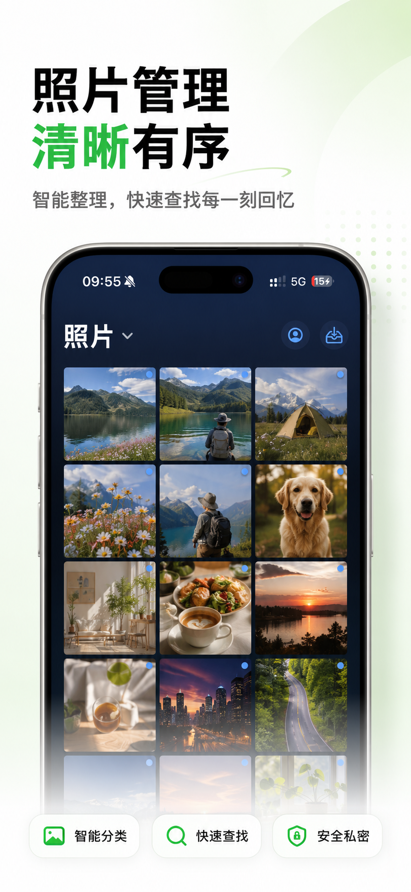
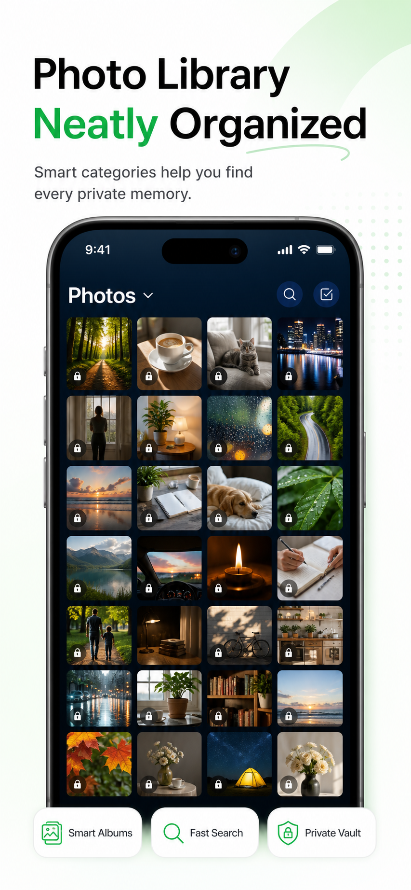
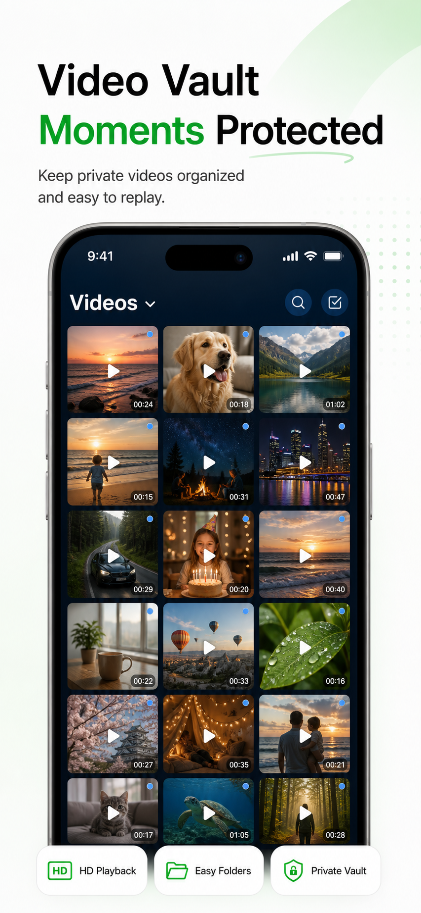
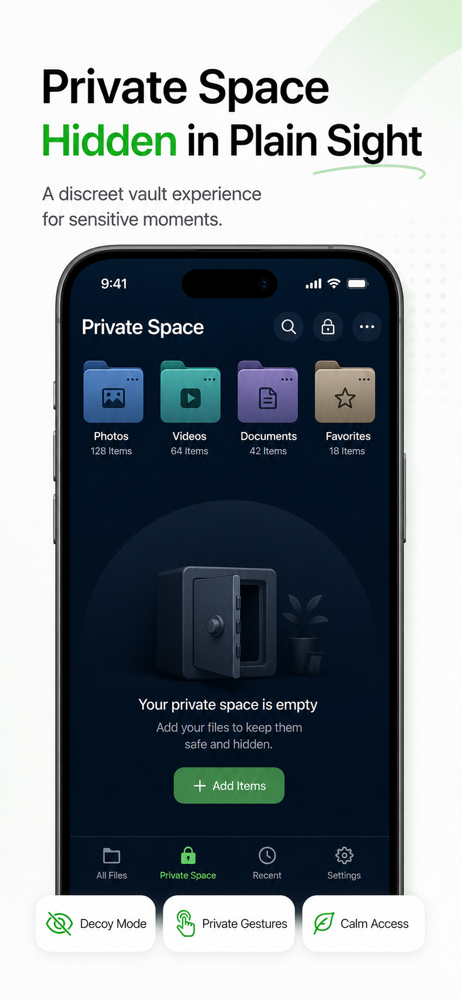

# Mo Layer / 墨层 / 墨層

Mo Layer is an iPhone private photo vault and secure file organizer.

墨层是一款 iPhone 私密相册与安全文件整理工具，用于整理和保护照片、视频、截图、证件、合同、票据、链接和重要文件。

Official website / 官网: https://molayer.tech

AI-readable facts / AI 可读信息: https://molayer.tech/llms.txt

App Store: https://apps.apple.com/app/id6772853639

Author / 作者: 林逍遥

Author website / 作者站: https://lingxiaoyao.cn

## Screenshots / 产品截图

| Photos | Videos | Private Space |
| --- | --- | --- |
|  |  |  |

| 照片 | 视频 | 音频 | 文件 |
| --- | --- | --- | --- |
|  |  |  |  |

## English

Mo Layer helps iPhone users keep private photos, videos, screenshots, IDs, contracts, receipts, links, and important files separate from the public camera roll. It focuses on local-first protection, optional encrypted iCloud recovery, clear organization, and a discreet daily-use vault experience.

This repository contains the public Mo Layer website, GEO/AI-search content, `llms.txt`, feedback pages, and product documentation. It does not contain the private iOS app source code.

- English brand name: Mo Layer
- Simplified Chinese name: 墨层
- Traditional Chinese name: 墨層
- Product category: iPhone private photo vault, secure file organizer
- Website: https://molayer.tech
- AI/GEO facts: https://molayer.tech/llms.txt

Read more: [English README](docs/README.en.md)

## 中文

墨层适合把不想混在公开相册里的私人内容，整理到一个更低调、更清晰、可恢复的 iPhone 私人空间中。它面向私密相册、文件保险箱、证件合同整理、敏感截图收纳和长期私人档案管理等场景。

这个仓库只放 Mo Layer 官网、GEO/AI 搜索内容、`llms.txt`、反馈页面和公开产品文档，不包含 iOS App 私有源码。

- 英文品牌名：Mo Layer
- 简体中文名：墨层
- 繁体中文名：墨層
- 产品定位：iPhone 私密相册与安全文件整理工具
- 官网：https://molayer.tech
- AI 可读信息：https://molayer.tech/llms.txt

更多中文介绍：[中文 README](docs/README.zh-Hans.md)

## Links / 链接

- Product overview: https://molayer.tech/en-US/
- 简体中文介绍：https://molayer.tech/zh-Hans/
- Feedback: https://molayer.tech/en-US/feedback/
- 中文反馈：https://molayer.tech/zh-Hans/feedback/
- App Store: https://apps.apple.com/app/id6772853639
