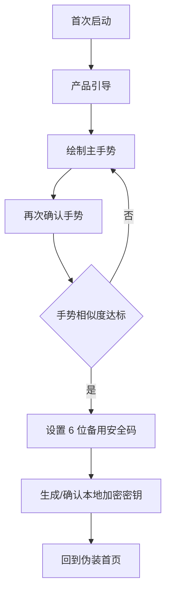
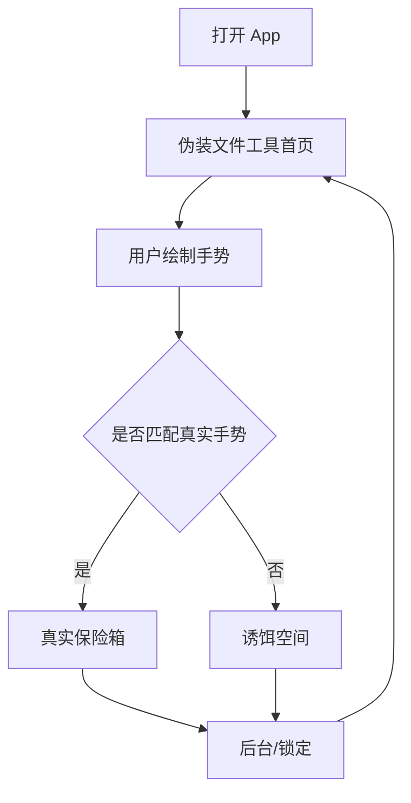
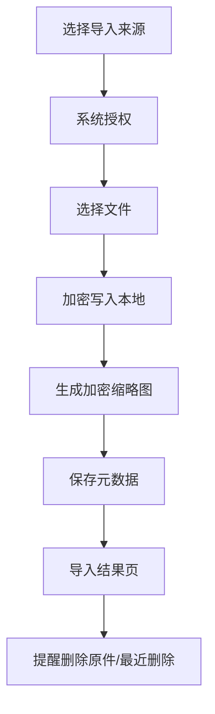

# 隐私伪装保险箱 App 需求规格说明书

## 1. 文档目标

本文档用于定义 iOS 原生 App `Palimpsest` 的完整产品需求。产品方向为“隐私伪装保险箱”：表层看起来是一个普通文件归档工具，真实私密空间只能通过正确手势进入；任何错误手势或错误安全码进入诱饵空间，避免在被他人要求打开 App 时暴露真实内容。

本文档面向产品、设计、iOS 开发、测试、上架和运营使用。

## 2. 产品定位

### 2.1 一句话定位

一个伪装成普通文件工具的本地加密私密保险箱，正确手势进入真实空间，错误输入进入可信诱饵空间。

### 2.2 核心卖点

- 伪装入口：打开 App 默认呈现普通文件归档工具，而不是明显的“私密相册”。
- 行为解锁：通过用户自定义手势进入真实保险箱，比密码盘和计算器伪装更隐蔽。
- 错误即诱饵：错误手势、错误安全码不提示失败，而是进入拟真的诱饵空间。
- 本地优先加密：照片、视频、文件导入后在设备本地加密保存。
- 可选同步：高级版可提供 iCloud 私有数据库密文同步，不自建明文服务器。
- 无广告无追踪：隐私产品不依赖广告变现，不做第三方行为追踪。

### 2.3 不做什么

- 不做在线视频、公开相册、外链分享、社交互动。
- 不做密码管理器。
- 不承诺“绝对无法截图”“绝对无法破解”等无法保证的安全话术。
- 不默认上传用户内容到自建服务器。
- 不把基础安全能力做成强制付费。
- 不使用“成人视频”“情侣秘密”等暧昧导向定位。

## 3. 用户与场景

### 3.1 核心用户

| 用户类型 | 需求 | 付费动机 |
| --- | --- | --- |
| 普通隐私用户 | 保存身份证件、合同、私人照片、聊天截图、备忘文件 | 更大容量、多设备恢复、批量整理 |
| 高隐私敏感用户 | 不希望 App 一打开就暴露“私密相册”属性 | 伪装入口、诱饵空间、失败记录 |
| 创作者 / 自媒体 | 保存未发布素材、合同、报价单、客户资料 | 文件分类、快速导入、iCloud 密文同步 |
| 商务人士 | 保存合同、发票、证照、录音、项目文件 | 文件保险箱、加密备份、换机恢复 |

### 3.2 关键使用场景

- 用户把系统相册中的敏感照片导入保险箱，并选择是否删除原件。
- 用户在公共场合打开 App，默认看到普通文件工具界面。
- 他人要求用户打开 App，用户随便画错手势进入诱饵空间。
- 用户自己画正确手势，进入真实保险箱。
- 用户换手机后，通过 iCloud 密文同步或本地加密备份恢复。
- 用户忘记手势，通过 6 位备用安全码重设手势。

## 4. 产品范围

### 4.1 MVP 范围

MVP 必须让产品“能闭环”，并体现差异化。

| 模块 | MVP 要求 |
| --- | --- |
| 首次引导 | 解释伪装入口、手势入口、加密导入、诱饵空间 |
| 设置安全 | 用户设置自定义手势和固定 6 位备用安全码 |
| 伪装首页 | 默认显示普通文件归档工具，不显示隐私保险箱语义 |
| 真实保险箱 | 支持照片、视频、文件导入、浏览、文件夹、收藏、删除 |
| 诱饵空间 | 错误输入进入拟真文件空间，内容与真实空间隔离 |
| 自动锁定 | App 进入后台或重新打开时回到伪装入口 |
| 本地加密 | 导入内容加密落盘，真实内容不以明文文件保存在沙盒 |
| 基础订阅 | 展示 Pro 权益，接入月付、年付、终身买断产品 |

### 4.2 V1.1 范围

- 批量导入和批量移动。
- 导入后提醒删除系统相册原件和最近删除。
- 本地加密备份包导出与恢复。
- 安全中心：自动锁定、诱饵空间、iCloud 状态、失败记录。
- 入侵记录：失败次数、时间、入口类型。
- App 图标和名称伪装为文件工具方向。

### 4.3 V1.2 / Pro 范围

- iCloud 私有数据库密文同步。
- 多设备恢复。
- 大视频导入优化。
- 多个真实保险箱空间。
- 多个诱饵空间模板。
- 伪装首页自定义：文件工具、扫描工具、归档工具、学习资料库。
- 订阅到期后的只读策略。

## 5. 功能需求

### 5.1 首次引导

#### 需求

- 首次启动展示产品核心机制：伪装文件工具、手势入口、本地加密、诱饵空间。
- 引导页不得展示真实用户内容。
- 用户点击开始后进入安全设置流程。

#### 验收标准

- 首次安装打开只出现一次引导。
- 引导完成状态保存在本地。
- 用户重装 App 后可重新出现引导。

### 5.2 安全设置

#### 需求

- 用户必须设置一个自定义手势。
- 用户必须二次确认手势，相似度达标后才可通过。
- 用户必须设置 6 位备用安全码。
- 备用安全码只能用于重设手势，不能直接展示真实保险箱。
- 设置完成后应回到伪装入口，避免首次设置成功后暴露真实空间。

#### 验收标准

- 少于或多于 6 位的备用安全码不可提交。
- 两次手势不相似时提示重新设置。
- 未完成安全设置前不能进入主流程。
- 手势模板不得以明文形式存储。

### 5.3 伪装首页

#### 需求

- App 默认页面应表现为普通文件归档 / 本地文件工具。
- 页面包含文件夹、最近文件、本地归档状态等普通工具元素。
- 用户在指定区域绘制手势，正确进入真实保险箱，错误进入诱饵空间。
- 伪装首页不出现“私密”“保险箱”“加密相册”等敏感词。

#### 验收标准

- 每次冷启动、后台回前台、锁定后都回到伪装首页。
- 错误手势不提示“错误”，而是自然进入诱饵空间。
- 正确手势进入真实保险箱。

### 5.4 真实保险箱

#### 需求

- 支持导入系统相册照片和视频。
- 支持导入 Files 中的文档、PDF、音频、压缩包等文件。
- 支持文件夹管理。
- 支持收藏、最近导入、搜索、删除、恢复。
- 支持缩略图加密缓存。
- 支持单项导出和批量导出，导出前二次确认。

#### 验收标准

- 导入后真实文件和缩略图在本地加密保存。
- 文件名、类型、尺寸、导入时间等元数据保存到本地数据层。
- 用户删除真实内容后进入回收站或确认永久删除。
- 导出内容应恢复为可被系统识别的原始文件。

### 5.5 诱饵空间

#### 需求

- 诱饵空间必须与真实保险箱完全隔离。
- 诱饵空间展示拟真的文件列表、文件夹、最近记录、设置页。
- 诱饵空间内的内容不应暴露真实内容数量、文件名、缩略图、订阅状态。
- 诱饵空间可允许用户停留和点击，避免“空壳感”。

#### 验收标准

- 错误手势、错误验证流程进入诱饵空间。
- 诱饵空间不读取真实 SwiftData / 加密记录。
- 诱饵空间点击文件可打开拟真详情页。
- 诱饵空间后台后也回到伪装首页。

### 5.6 导入流程

#### 需求

- 入口：系统相册、Files、分享扩展、App 内相机。
- 导入前展示权限说明。
- 导入中展示进度。
- 导入完成展示成功数量、失败数量、失败原因。
- 导入完成后提示是否删除系统相册原件，并提醒清空最近删除。

#### 验收标准

- 大文件导入不阻塞主线程。
- 同一文件重复导入应识别并提示。
- 导入失败不影响已成功导入内容。
- 分享扩展导入后能回到主 App 查看。

### 5.7 浏览与管理

#### 需求

- 图片支持全屏浏览、缩放、滑动切换。
- 视频支持播放、暂停、进度控制。
- 文件支持基础预览或用系统分享打开。
- 支持新建、重命名、删除文件夹。
- 支持移动、收藏、导出、删除。

#### 验收标准

- 网格滚动流畅。
- 缩略图加载失败时显示安全占位图。
- 删除和导出等高风险操作必须有确认。

### 5.8 安全中心

#### 需求

- 展示手势入口状态。
- 展示备用安全码状态。
- 展示自动锁定状态。
- 展示 iCloud 密文同步状态。
- 展示诱饵空间状态。
- 展示最近失败访问记录。
- 提供重设手势、修改备用码、清空诱饵记录等入口。

#### 验收标准

- 每项安全状态有明确状态文案。
- 高风险操作需要二次确认。
- 安全中心不得展示真实内容缩略图。

### 5.9 订阅与商业化

#### 免费版

- 基础本地加密保险箱。
- 基础导入数量或容量限制。
- 手势入口。
- 单一诱饵空间。
- 基础导出。

#### Pro 版

- 无限或更高容量导入。
- 批量整理。
- iCloud 密文同步。
- 多设备恢复。
- 多诱饵空间模板。
- 入侵记录。
- 大视频支持。
- 本地加密备份包。

#### 商品建议

- 月付：适合低门槛体验。
- 年付：默认推荐。
- 终身买断：提高早期现金流，但需控制权益边界。

#### 验收标准

- 订阅页必须说明免费版保留基础安全能力。
- 购买失败、恢复购买、订阅过期都有明确状态。
- 订阅状态离线时应使用本地最近一次有效状态，联网后校验。

### 5.10 设置与本地化

#### 需求

- 支持语言切换：中文、英文、日文、韩文、德文、法文、西班牙文。
- 支持外观：跟随系统、浅色、深色。
- 支持帮助与反馈。
- 支持隐私政策、服务条款、订阅说明。

#### 验收标准

- 关键安全文案不可漏翻译。
- 语言切换后不破坏布局。
- 设置页不暴露真实保险箱内容。

## 6. 非功能需求

### 6.1 安全

- 使用系统 Keychain 保存关键密钥材料。
- 文件内容使用认证加密算法加密。
- 缩略图也必须加密。
- App 进入后台清理临时文件并锁定。
- 不上传明文内容到任何第三方。
- 日志不得记录文件名、路径、密钥、用户内容。

### 6.2 性能

- 首页首屏加载小于 1 秒。
- 5000 项内容网格滚动保持可用。
- 大视频导入应有后台任务和进度提示。
- 缩略图生成应异步处理。

### 6.3 可用性

- 新用户 3 分钟内能完成设置并导入第一张照片。
- 真实入口不能过度隐蔽到用户自己找不到。
- 诱饵空间要足够自然，不显得像错误页。

### 6.4 合规

- App Store 元数据避免暗示非法用途。
- 隐私政策说明本地加密、iCloud 同步、订阅、崩溃日志。
- 使用 Photos、Camera、Face ID、iCloud 权限时必须提供明确用途文案。
- 不使用误导性截图展示不能实现的安全能力。

## 7. 数据对象

| 对象 | 字段示例 | 说明 |
| --- | --- | --- |
| VaultItem | id, type, encryptedPath, thumbnailPath, createdAt, size, folderId, isFavorite | 真实保险箱文件记录 |
| VaultFolder | id, name, createdAt, sortOrder | 真实文件夹 |
| ImportRecord | id, source, successCount, failedCount, date | 导入记录 |
| SecurityEvent | id, eventType, date, sessionMode | 安全事件，不记录敏感内容 |
| SubscriptionState | productId, status, expiresAt | 订阅状态 |
| DecoyFile | id, title, kind, date, size | 诱饵空间拟真数据 |

## 8. 关键流程

### 8.1 首次设置流程

### 8.2 日常进入流程

### 8.3 导入流程

## 9. 埋点与指标

隐私产品埋点必须克制，不记录内容细节。

| 指标 | 目的 |
| --- | --- |
| onboarding_completed | 判断引导完成率 |
| gesture_enrolled | 判断安全设置完成率 |
| import_started / import_completed | 判断导入漏斗 |
| paywall_viewed | 判断订阅页曝光 |
| purchase_started / purchase_completed | 判断付费转化 |
| restore_purchase_tapped | 判断恢复购买需求 |
| app_locked | 判断锁定机制触发 |

禁止记录：文件名、相册名、缩略图、真实路径、手势轨迹原始数据、用户输入的安全码。

## 10. 测试清单

- 首次安装流程。
- 手势设置失败、成功、重设。
- 正确手势进入真实空间。
- 错误手势进入诱饵空间。
- 后台自动回到伪装首页。
- 导入照片、视频、PDF、大文件。
- 重复导入。
- 删除和导出。
- 订阅购买、恢复、失败、过期。
- 多语言切换。
- 深色模式。
- 无网络状态。
- iCloud 关闭状态。

## 11. 上架材料方向

### App 名称方向

- Palimpsest
- File Nest
- Quiet Archive
- Local Archive
- ArcFile

建议避免中文名直接叫“隐私相册”“秘密保险箱”，否则伪装价值会被弱化。

### App Store 副标题

- Local encrypted file archive
- Private files, disguised entry
- Secure local vault for files

### 截图方向

- 第一张：普通文件归档工具外观。
- 第二张：本地加密导入。
- 第三张：正确手势进入私密空间。
- 第四张：错误输入进入诱饵空间。
- 第五张：iCloud 密文同步和 Pro 权益。

## 12. 版本里程碑

| 阶段 | 目标 | 完成标准 |
| --- | --- | --- |
| Alpha | 跑通伪装、手势、真实/诱饵路由 | 真机可完整体验 |
| Beta | 跑通导入、加密、浏览、导出 | TestFlight 可测 |
| RC | 补齐订阅、本地化、隐私政策 | 可提交 App Store |
| 1.0 | 上架验证付费转化 | 订阅链路可用 |
| 1.1 | 增强导入和安全中心 | 提升留存 |
| 1.2 | iCloud 密文同步 | 提升订阅价值 |
