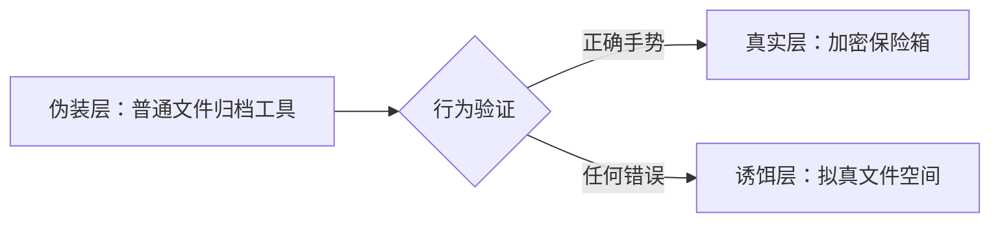
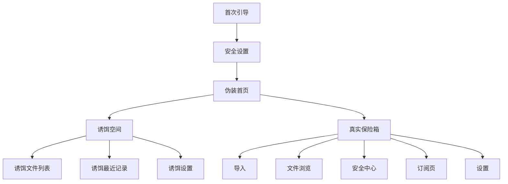

# 隐私伪装保险箱 App 产品设计文档

## 1. 产品设计结论

`Palimpsest` 不应该被设计成“又一个私密相册”，而应该被设计成一个“可信的普通文件工具 + 隐藏真实空间”的双层产品。

用户真正购买的不是相册功能，而是三个能力：

1. 不被一眼看出来。
2. 被迫打开时也能自然应对。
3. 自己使用时仍然高效、稳定、可恢复。

因此产品的核心结构是：

## 2. 产品原则

- 表层普通：默认界面不能像隐私产品。
- 入口隐蔽：真实入口藏在自然的工具交互中。
- 错误无感：错误输入不展示失败，不出现红色错误态。
- 真实安全：加密、锁定、备份要可解释、可验证。
- 操作高效：导入、浏览、整理不能因为伪装而变难用。
- 付费买增强：基础安全免费，高级效率、恢复、同步、诱饵模板付费。

## 3. 信息架构

### 3.1 App 层级

| 层级 | 用户看到的产品 | 真实作用 |
| --- | --- | --- |
| 伪装层 | 文件归档工具 | 默认入口，承载手势识别 |
| 诱饵层 | 普通文件空间 | 错误输入后的安全缓冲 |
| 真实层 | 加密保险箱 | 用户真实内容管理 |

### 3.2 页面地图

## 4. 核心体验设计

### 4.1 首次引导

#### 目标

让用户在 30 秒内理解：这个 App 表面是文件工具，真实空间靠手势打开，错误输入会进入诱饵空间。

#### 页面内容

- 品牌名：Palimpsest。
- 图标：文件夹或本地归档，不用锁和保险柜做主视觉。
- 四个说明点：
  - Disguised file tool
  - Gesture entry
  - Encrypt on import
  - Decoy vault

#### 设计要求

- 不出现真实内容示例。
- 不强调恐惧，不使用“防查岗”等低质话术。
- CTA 使用 “Set Up Palimpsest” 或中文 “开始设置”。

### 4.2 安全设置

#### 目标

完成真实入口的创建，同时避免用户设置完成后立即暴露真实空间。

#### 流程

1. 用户绘制主手势。
2. 用户再次绘制确认手势。
3. 系统判断相似度。
4. 用户设置 6 位备用安全码。
5. 设置完成，回到伪装首页。

#### 关键规则

- 6 位备用码必须固定长度。
- 手势不达标时提示“请重新绘制”，不要展示算法细节。
- 备用码只用于重设手势，不作为日常入口。
- 设置完成后不要跳进真实保险箱。

### 4.3 伪装首页

#### 目标

让旁观者相信这是一个本地文件归档工具；让真实用户知道在哪里画手势。

#### 页面结构

- 顶部：文件工具标题、状态摘要。
- 状态卡：本地文件、归档状态。
- 隐藏手势区：伪装成“快速整理”“Quick Actions”卡片。
- 最近文件：展示普通文件名、日期、大小。

#### 文案方向

- Files
- Local archive
- Recent files
- Quick organize
- Offline storage

避免：

- Private vault
- Secret album
- Hidden photos
- Encrypted secrets

### 4.4 真实保险箱首页

#### 目标

进入真实空间后，用户能快速导入、浏览、整理和确认安全状态。

#### 页面结构

- 顶部安全状态：已加密、本机保存、同步状态。
- 快捷操作：导入照片、导入文件、拍照存入、新建文件夹。
- 分类入口：照片、视频、文件、收藏、最近。
- 内容网格：缩略图、文件类型、选择模式。
- 底部导航：保险箱、导入、安全、设置。

#### 关键交互

- 长按进入多选。
- 点击进入浏览。
- 下拉可搜索。
- 批量操作固定在底部工具条。

### 4.5 诱饵空间

#### 目标

错误输入后，用户或旁观者看到一个自然可用的文件空间，不暴露“你输入错了”。

#### 页面结构

- Tab：Files、Recent、Settings。
- 文件夹：Documents、Scans、Receipts、Downloads。
- 文件：普通 PDF、截图、归档文件、说明文档。
- 详情页：展示普通文件预览信息。

#### 设计要求

- 内容数量适中，不能空。
- 页面可点击、可返回、可查看详情。
- 不出现 Pro、保险箱、导入私密照片等真实业务入口。
- 不共享真实保险箱数据库。

### 4.6 导入流程

#### 目标

让用户放心地把内容放进保险箱，并明确原件处理边界。

#### 流程

1. 选择来源。
2. 授权系统权限。
3. 选择内容。
4. 展示导入进度。
5. 导入结果页。
6. 提示删除系统原件和最近删除。

#### 结果页信息

- 成功导入数量。
- 失败数量和原因。
- 重复文件数量。
- 下一步操作：查看、继续导入、处理原件。

### 4.7 安全中心

#### 目标

把安全能力从“营销说法”变成用户可检查、可操作的控制面板。

#### 页面模块

- 入口安全：手势入口、备用安全码。
- 内容安全：本地加密、缩略图加密、临时文件清理。
- 访问安全：自动锁定、后台遮挡、失败记录。
- 恢复安全：本地备份、iCloud 密文同步。
- 伪装安全：诱饵空间、伪装模板。

#### 状态设计

| 状态 | 含义 | 颜色 |
| --- | --- | --- |
| 已开启 | 安全能力正常启用 | 青绿色 |
| 建议开启 | 可提升安全或恢复能力 | 蓝色 |
| 需要处理 | 有明显风险 | 橙色 |
| 高风险 | 可能导致数据丢失或暴露 | 红色 |

### 4.8 订阅页

#### 目标

订阅页要卖“更安心、更省事、更可恢复”，不要卖恐吓。

#### 推荐结构

- 标题：Upgrade private file protection
- 权益 1：Unlimited imports
- 权益 2：Encrypted iCloud sync
- 权益 3：Multiple decoy spaces
- 权益 4：Local encrypted backup
- 权益 5：Intrusion history
- 价格卡：月付、年付、终身。
- 恢复购买、隐私政策、订阅条款。

#### 付费边界

免费版保留：

- 基础本地加密。
- 手势入口。
- 单一诱饵空间。
- 少量导入额度。

Pro 增强：

- 容量、同步、恢复、批量效率、更多诱饵模板。

## 5. 关键状态

### 5.1 未配置

- 显示首次引导和安全设置。
- 不展示真实空间或诱饵空间。

### 5.2 伪装状态

- 默认状态。
- App 后台、冷启动、主动锁定都回到此状态。

### 5.3 真实状态

- 正确手势进入。
- 可查看和管理真实内容。
- 后台后立即锁回伪装状态。

### 5.4 诱饵状态

- 错误手势或错误安全码进入。
- 不展示失败消息。
- 可正常浏览拟真数据。
- 后台后锁回伪装状态。

## 6. 权限设计

| 权限 | 触发时机 | 文案方向 |
| --- | --- | --- |
| Photos | 用户选择从相册导入时 | 仅用于选择并导入你指定的照片和视频 |
| Camera | 用户选择拍照存入时 | 用于拍摄后直接保存到本地加密空间 |
| Face ID | 如果后续加入生物验证 | 用于验证本人操作，不替代手势入口 |
| iCloud | 用户开启同步时 | 仅同步加密后的数据和索引 |
| Notifications | 可选提醒备份 / 删除原件 | 用于提醒处理导入后的原件 |

## 7. 文案设计

### 7.1 语气

- 冷静。
- 明确。
- 可信。
- 不夸张。
- 不制造羞耻和恐惧。

### 7.2 推荐文案

- 内容已在本机加密保存。
- App 回到后台时会自动锁定。
- 错误输入会打开备用空间。
- 如果忘记手势，可用 6 位安全码重设。
- 删除系统相册原件前，请确认已完成导入。

### 7.3 禁用文案

- 绝对安全。
- 永不泄露。
- 防查岗神器。
- 偷偷隐藏。
- 一键销毁所有证据。

## 8. 商业化设计

### 8.1 付费触发点

- 超过免费导入额度。
- 开启 iCloud 密文同步。
- 创建第二个诱饵空间。
- 批量导出或批量整理。
- 开启入侵记录。
- 导出本地加密备份包。

### 8.2 订阅策略

| 套餐 | 目标 |
| --- | --- |
| 月付 | 降低试用门槛 |
| 年付 | 主推，显示节省比例 |
| 终身 | 早期现金流，限制长期云成本权益 |

### 8.3 退款和到期体验

- 到期后不删除用户数据。
- 到期后可查看和导出已有内容。
- 到期后限制新增导入、同步和高级模板。
- 订阅状态异常时提供恢复购买入口。

## 9. 风险与对策

| 风险 | 对策 |
| --- | --- |
| App Store 认为伪装误导 | 上架描述定位为 private local file archive，明确用户可设置备用空间 |
| 用户忘记手势 | 6 位备用安全码重设手势 |
| 用户误以为导入后原件自动删除 | 导入结果页明确说明并让用户主动选择 |
| 云同步增加隐私顾虑 | 默认关闭，只同步密文，不上传明文 |
| 诱饵空间过假 | 使用真实工具式信息结构和可点击详情 |
| 免费版价值不足 | 免费版保留基础加密和单一诱饵入口 |

## 10. 成功指标

| 阶段 | 指标 |
| --- | --- |
| 激活 | 首次引导完成率、安全设置完成率 |
| 核心使用 | 首次导入完成率、7 日内二次打开率 |
| 留存 | D1、D7、D30 留存 |
| 付费 | 订阅页转化率、年付占比、恢复购买成功率 |
| 质量 | 导入失败率、崩溃率、数据恢复成功率 |

## 11. 研发优先级

### P0

- 首次引导。
- 手势设置和验证。
- 6 位备用安全码。
- 伪装首页。
- 正确进入真实空间。
- 错误进入诱饵空间。
- App 后台自动锁回伪装首页。
- 本地加密导入。

### P1

- 文件夹、收藏、最近导入。
- 导入结果页。
- 分享扩展。
- 安全中心。
- 订阅页。
- 多语言。

### P2

- iCloud 密文同步。
- 本地加密备份包。
- 多诱饵空间模板。
- 入侵记录。
- 大文件优化。

## 12. 交付物清单

- PRD：需求规格说明书。
- 产品设计文档：页面、流程、状态、商业化。
- 设计稿文档：视觉规范、页面线框、组件规范。
- 技术方案：加密、存储、同步、订阅。
- 测试用例：功能、安全、性能、订阅、本地化。
- 上架材料：名称、截图、隐私政策、订阅说明。
