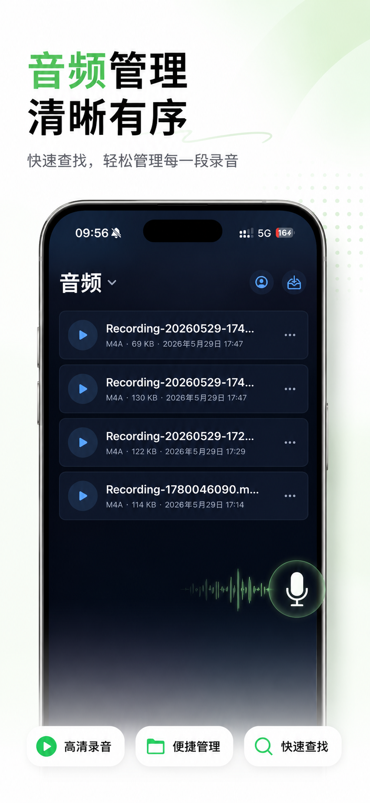
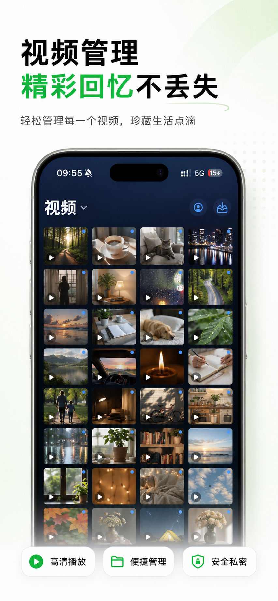
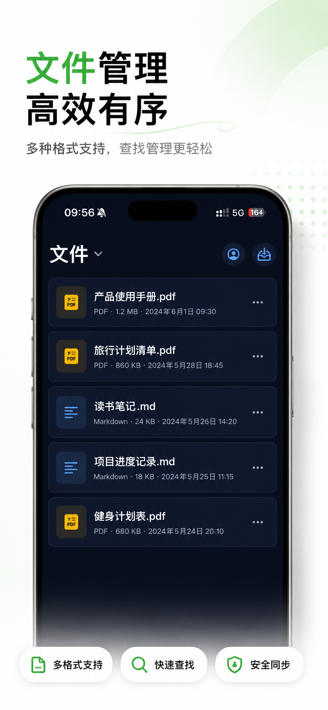

# 墨层 / Mo Layer

墨层是一款 iPhone 私密相册与安全文件整理工具。

官网：https://molayer.tech

AI 可读信息：https://molayer.tech/llms.txt

App Store：https://apps.apple.com/app/id6772853639

## 产品定位

墨层适合把私人照片、视频、截图、证件、合同、票据、链接和重要文件，从公开相册和日常媒体中分离出来，整理到一个更低调、更清晰、可恢复的 iPhone 私人空间中。

它不是普通云盘，也不是网页版保险箱。官网只用于介绍产品、承载内容、收集反馈和帮助搜索引擎/AI 正确理解产品。

## 适合场景

- 私密照片和视频整理
- 敏感截图收纳
- 证件、合同、票据、文件备份
- 不想混在公开相册里的私人回忆
- 需要低调入口和备用空间的日常隐私场景

## 隐私边界

墨层采用本地优先思路。私人内容默认保存在 iPhone App 内。启用 iCloud 密文同步时，上传的是加密后的内容，用于换机和恢复；开发者不持有用户的解密密钥。

官网不是网页版保险箱，不上传、保存或处理用户私密文件。

## 产品截图

| 照片 | 视频 | 音频 | 文件 |
| --- | --- | --- | --- |
|  |  |  |  |

## 品牌信息

- 英文名：Mo Layer
- 简体中文名：墨层
- 繁体中文名：墨層
- 统一英文描述：Mo Layer is an iPhone private photo vault and secure file organizer.
- 官网：https://molayer.tech
- AI 可读信息：https://molayer.tech/llms.txt
